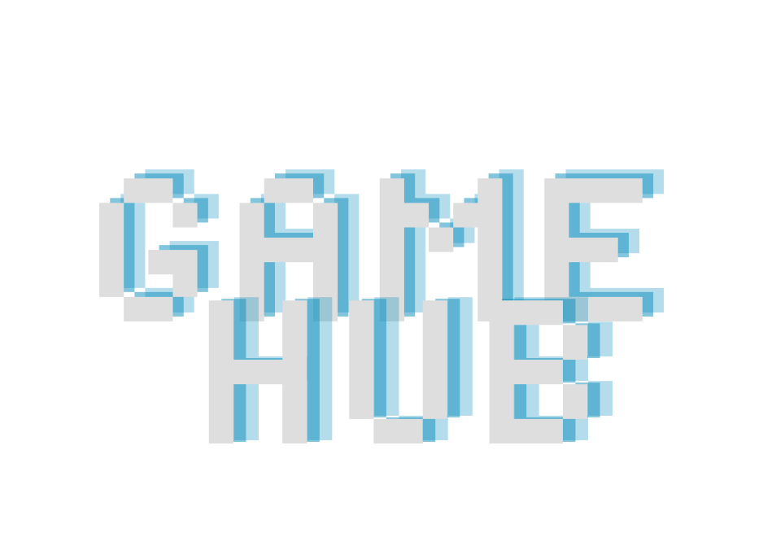

<h1 align=center>Trabalho final React - Game Hub</h1>

  
Nosso projeto simula uma loja de Jogos feito com React.JS onde qualquer pessoa possa acessar e comprar os nossos diversos produtos!

  
  

<h2>Conteúdo que você encontrará no projeto</h2>
  <ul>
    <li><code>assets</code>: Pasta com arquivos e fotos do projeto.</li>
    <li><code>components</code>: Componentes do projeto, ajuda na reutilização de código.</li>
    <li><code>pages</code>: Páginas do projeto, como Home, Login, entre outros.</li>
  </ul>
<h2>Componentes do Projeto</h2>

Os componentes são recursos utilizados para melhorar a reutilização de código em diversas partes do código. É um recurso muito valioso do React.

  <ul>
    <li>Background</li>
    <li>Card</li>
    <li>ListaCateg</li>
    <li>ContactForm</li>
    <li>GameForm</li>
    <li>Switch</li>
    <li>Header</li>
    <li>Footer</li>
    <li>ImgAbout</li>
    <li>Input_Login</li>
    <li>ThemeContext</li>
  </ul>
<h2>Páginas do projeto</h2>
  <ul>
    <li>Sobre nós</li>
    <li>Cadastro</li>
    <li>Categoria</li>
    <li>Home</li>
    <li>Jogos</li>
    <li>Login</li>
    <li>Contato</li>
    <li>Gerenciamento</li>
  </ul>
<h2>Tecnologias Utilizadas</h2>

<h2>Nossos Fundadores</h2>

<a href="https://github.com/FelipeSutter">Felipe Sutter</a> | 
<a href="https://github.com/Rofogale">Marco Aurélio</a> | 
<a href="https://github.com/lucascaiafa00">Lucas Caiafa</a> | 
<a href="https://github.com/bordeguilherme">Guilherme Borde</a> | 
<a href="https://github.com/RafaelVPL">Rafael Vinícius</a>

